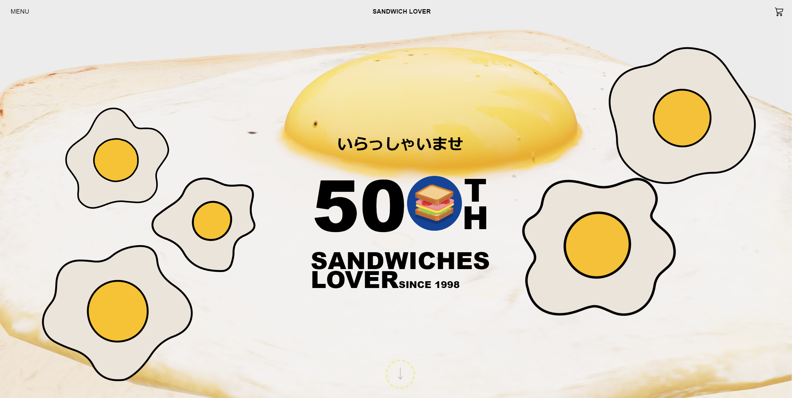

# Alphitter

Portfolio

## Getting Start

    git clone https://github.com/a88759666/3dRestaurant.git

    npm install

    npm run dev

## Deployment

前往 [https://a88759666.github.io/3dRestaurant](https://a88759666.github.io/3dRestaurant/)

## Intro

1. 簡易的模擬餐廳網站
2. 互動式點餐的功能

## 開發環境

  * React Vite
  * Typescript
  * Tailwind樣式開發

This project was bootstrapped with [Create React App](https://github.com/facebook/create-react-app).
